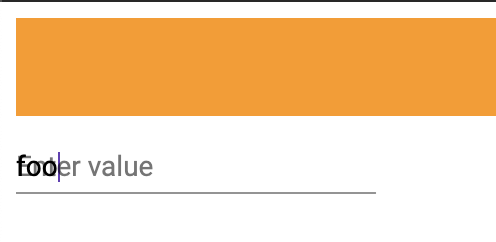

# AmplifyAngularDummy

## Setup

1. clone the repository
2. run `npm install -g @angular/cli`
2. run `npm install`
3. install the amplify CLI with `npm install -g @aws-amplify/cli`
4. run `amplify init` (with Angular defaults)
5. run `amplify add auth`
5. run `amplify push`
6. run `ng serve`

Then open up `localhost:4200`. You will be prompted to sign in or create an account. 

After authenticating you should see the following screen:

When you type something into the input, the material animation is not working properly.

